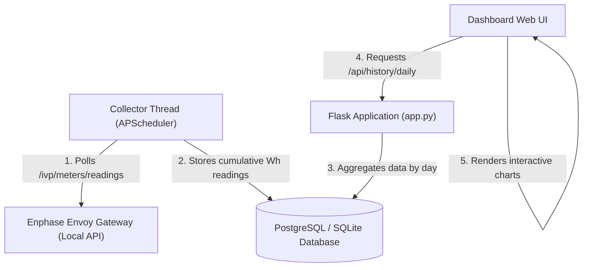

# Daily Energy Production & Tracking Integration

This document outlines the architecture, database schema, data collection strategy, and visualization setup implemented to track daily solar statistics inside the `enphase-dashboard` project.

---

## 1. System Architecture & Data Flow

### Key Design Principle: Cumulative Meter Accumulation
To ensure high data resiliency, the collector logs **lifetime cumulative active energy counters** in Watt-hours (`Wh`):
* `production_wh`: Cumulative production energy delivered by the solar array.
* `import_wh`: Cumulative grid energy imported (delivered to the house).
* `export_wh`: Cumulative grid energy exported (received from the house).

By subtracting the start-of-day cumulative value from the end-of-day cumulative value, we obtain exact daily totals. This design guarantees that even if the collector server is offline for days, **no energy data is lost or miscounted** once the server resumes.

---

## 2. Database Schema Design

The system uses two SQL tables defined in `db.py`:

### `meter_readings` (Raw Periodic Readings)
Stores raw measurements taken every 15 minutes.
* `timestamp` (DateTime, Primary Key, index) - Naive UTC timestamp of the reading.
* `production_wh` (Float) - Cumulative production meter reading.
* `import_wh` (Float) - Cumulative grid meter import reading.
* `export_wh` (Float) - Cumulative grid meter export reading.

### `daily_stats` (Pre-Aggregated Daily Totals)
Stores calculated daily statistics for fast dashboard queries.
* `date` (Date, Primary Key) - The calendar date.
* `production_kwh` (Float) - Total production for the day in kWh.
* `import_kwh` (Float) - Total imported from the grid in kWh.
* `export_kwh` (Float) - Total exported to the grid in kWh.
* `consumption_kwh` (Float) - Total consumed by the house in kWh.
* `is_interpolated` (Boolean) - True if the data for this day was estimated/interpolated due to server downtime.
* `updated_at` (DateTime) - Last time this record was updated.

---

## 3. Mathematical Formulas & Resiliency

### Daily Energy Calculation
For any given date, energy metrics (in kWh) are computed as:
1. **Solar Production**:
   $$\text{Production} = \frac{\text{production\_wh}(T_{\text{last}}) - \text{production\_wh}(T_{\text{first}})}{1000}$$
2. **Grid Export**:
   $$\text{Grid Export} = \frac{\text{export\_wh}(T_{\text{last}}) - \text{export\_wh}(T_{\text{first}})}{1000}$$
3. **Grid Import**:
   $$\text{Grid Import} = \frac{\text{import\_wh}(T_{\text{last}}) - \text{import\_wh}(T_{\text{first}})}{1000}$$
4. **House Consumption**:
   $$\text{House Consumption} = \text{Solar Production} - \text{Grid Export} + \text{Grid Import}$$

*(Where $T_{\text{first}}$ is the first reading of the day and $T_{\text{last}}$ is the last reading of the day. If $T_{\text{first}}$ is missing, the last reading of the previous day is used.)*

### Handling Server Downtime (> 2 Hours)
If the server is offline for multiple days, a gap is detected between the last recorded timestamp ($T_{\text{offline}}$) and the first new timestamp ($T_{\text{online}}$).
1. **Total Gap Delta**: The total accumulated energy difference during the gap is calculated. This difference is 100% accurate because the Enphase Envoy gateway continues counting.
2. **Linear Interpolation**: The total energy delta is distributed proportionally across all calendar days spanned by the downtime based on the number of hours the day spent in downtime.
3. **Estimation Flag**: Aggregated daily stats generated during gaps are flagged with `is_interpolated = True`. The frontend dashboard visually styles these days with an "Estimated" tag and chart tooltip warning to indicate that they are estimates.

---

## 4. Summary of Code Implementations

* **[db.py](file:///home/nil/code/enphase-dashboard/db.py)**: Configures Flask-SQLAlchemy and holds the model schemas for both tables. Using naive UTC datetimes prevents type mismatch errors across SQLite and Postgres.
* **[dashboard_services.py](file:///home/nil/code/enphase-dashboard/dashboard_services.py)**: Houses background collection, daily aggregation math, and linear gap interpolation logic.
* **[app.py](file:///home/nil/code/enphase-dashboard/app.py)**: Connects the database configuration, starts `Flask-APScheduler` to poll the Envoy local API every 15 minutes, handles circular startup dependencies, and registers historical HTTP routes (`/api/history/daily` and `/api/history/refresh`).
* **[docker-compose.yml](file:///home/nil/code/enphase-dashboard/docker-compose.yml)**: Integrates an `enphase-db` PostgreSQL service with a persistent volume to back the production deployment.
* **[templates/base.html](file:///home/nil/code/enphase-dashboard/templates/base.html)**: Includes the Chart.js script tag and adds the "Daily History" tab button.
* **[templates/tabs/history.html](file:///home/nil/code/enphase-dashboard/templates/tabs/history.html)**: Layout containing the Chart.js canvas and detailed tabular data logging.
* **[static/js/dashboard.js](file:///home/nil/code/enphase-dashboard/static/js/dashboard.js)**: Implements historical lazy-loading, sync button API calls, and chart initialization.
